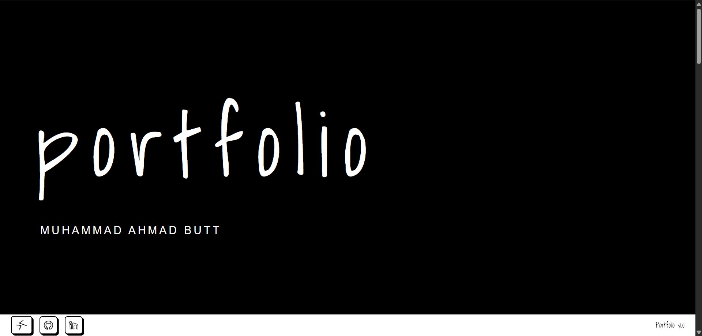
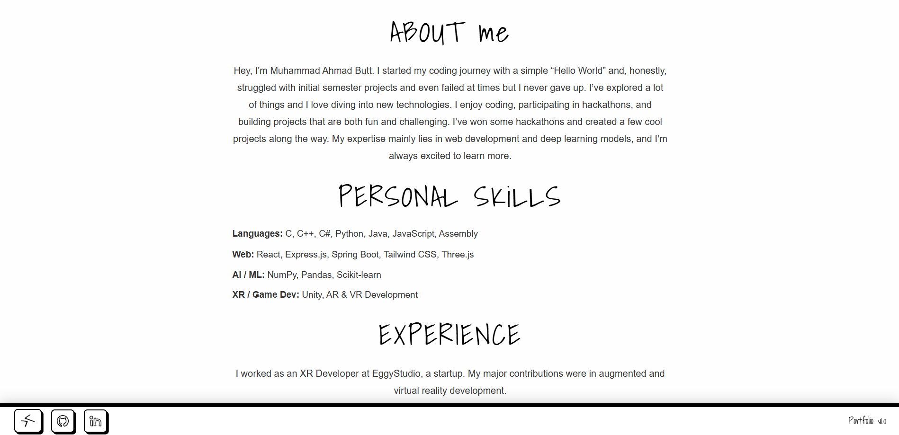
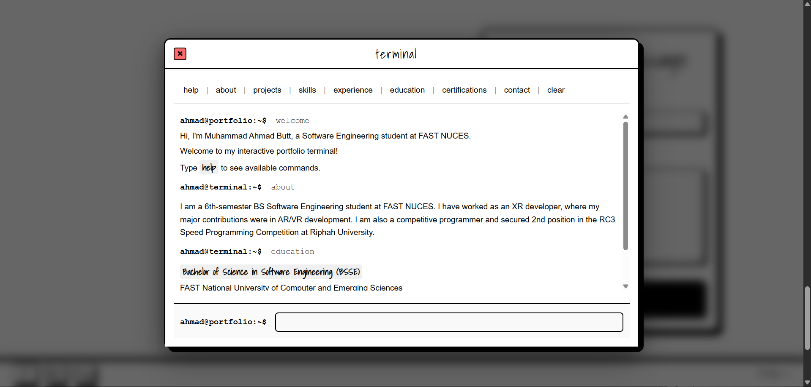
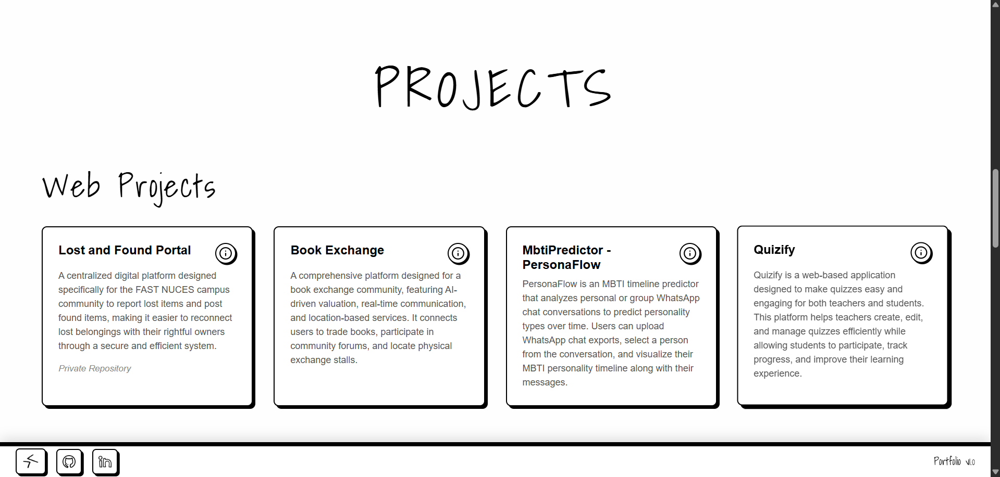
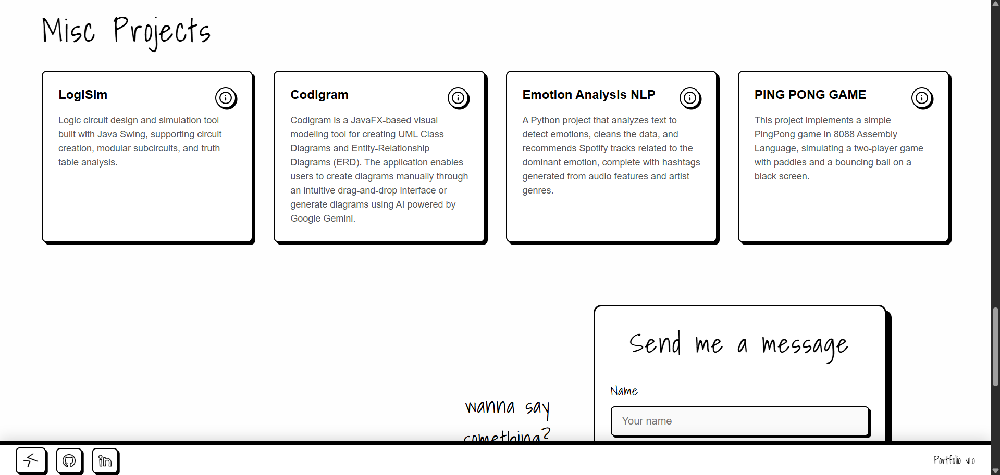
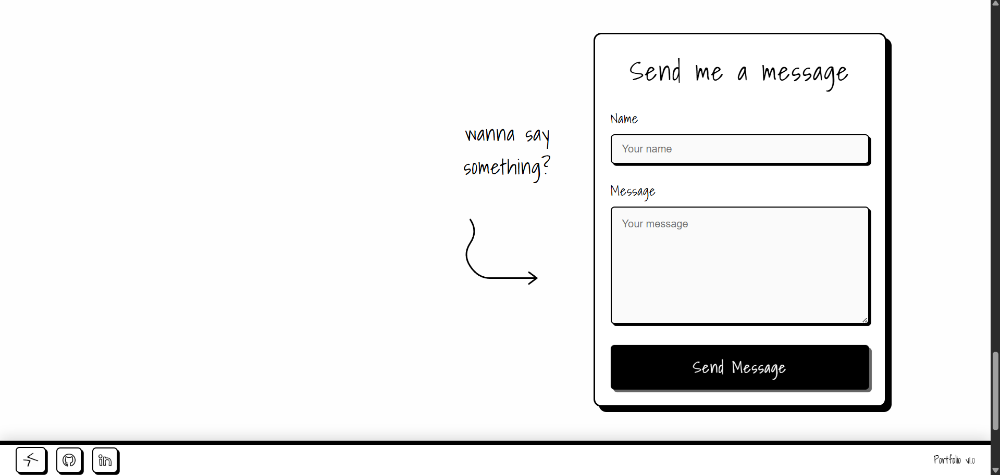

# Personal Portfolio - Hand Drawn Type
A unique and creative portfolio website featuring hand-drawn aesthetics with an interactive terminal interface.

## Screenshots








## Installation
```bash
# Clone the repository
git clone https://github.com/m-ahmad-butt/Portfolio-HandDrawn.git

# Navigate to project directory
cd Portfolio-HandDrawn

# Install dependencies
npm install

# Start development server
npm run dev
```

## EmailJS Configuration
This portfolio uses EmailJS to handle contact form submissions without requiring a backend server. EmailJS is a JavaScript library that allows you to send emails directly from client-side code by connecting to your email service provider. It provides a simple API to integrate email functionality into your web applications, making it perfect for static sites and portfolios where you want to receive messages from visitors without setting up server infrastructure.

To enable the contact form:
1. Create a free account on [EmailJS](https://www.emailjs.com/)
2. Set up your email service (Gmail, Outlook, etc.)
3. Create an email template
4. Get your Service ID, Template ID, and Public Key
5. Create a `.env` file in the root directory with the following format:

```env
VITE_EMAILJS_SERVICE_ID=your_service_id
VITE_EMAILJS_TEMPLATE_ID=your_template_id
VITE_EMAILJS_PUBLIC_KEY=your_public_key
```

6. Update the Contact component to use these environment variables

## License
MIT License - feel free to use this for your own portfolio!<br>
Inspired by (Ulyana Sukhanitskaya): https://www.behance.net/gallery/231582523/Portfolio-2025?tracking_source=search_projects|portfolio&l=7